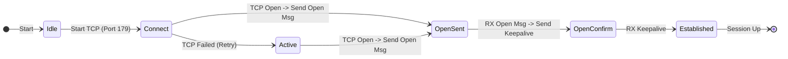

import Quiz from '@site/src/components/Quiz';

# 🌐 BGP Master Class: The Architecture of the Internet

Welcome to the deep dive into the **Border Gateway Protocol (BGP)**. This is not just about connecting routers; it's about connecting the world.

---

## 🔄 The BGP Finite State Machine

BGP uses a complex state machine to establish a peering session.

### 🧠 Understanding the States
1.  **Idle**: The beginning. If you are stuck here, you likely have no route to the neighbor or the interface is down.
2.  **Connect**: Trying to complete the TCP 3-way handshake.
3.  **Active**: The "Bad" state. It means "I am actively trying to connect, but failing." Usually implies a firewall block, mismatching config, or stuck in a retry loop.
4.  **OpenSent**: TCP is up! I have sent my BGP Parameters (ASN, Hold Time, Router ID).
5.  **OpenConfirm**: I heard from you. I am waiting for the final handshake.
6.  **Established**: The Holy Grail. We are exchanging routes.

---

## 📨 BGP Message Types

BGP speaks only 4 languages (Message Types):

1.  **OPEN**: "Hello, let's talk." Includes ASN, Hold Time, Router ID.
2.  **UPDATE**: "Here is the news." Contains:
    *   **Withdrawn Routes**: Networks that went down.
    *   **Path Attributes**: Properties of the paths.
    *   **NLRI (Network Layer Reachability Information)**: The actual prefixes (IPs).
3.  **NOTIFICATION**: "Something is wrong, goodbye." Sent when an error occurs (e.g., wrong AS, Bad Message). Session closes immediately.
4.  **KEEPALIVE**: "I'm still here." Prevents the hold-timer from expiring (Default: 60s hello / 180s hold).

---

## 🚦 The 13-Step Best Path Selection Algorithm

BGP does not use bandwidth or delay. It uses a political list of tie-breakers. Memorize this mnemonic: **"We Love Oranges As Oranges Mean Pure Refreshment."**

| Step | Attribute | Preference | Notes |
| :--- | :--- | :--- | :--- |
| 1 | **Weight** | Highest | Cisco Proprietary. Local to the router ONLY. |
| 2 | **Local Preference** | Highest | The most common tool for outbound traffic engineering. Propagates within the AS. |
| 3 | **Locally Originated** | Yes | Prefer routes I created (via `network` or `aggregate`) over learned ones. |
| 4 | **AS Path** | Shortest | The classic BGP metric. Fewer hops is better. (Use **AS-Prepend** to make a path look worse). |
| 5 | **Origin Code** | IGP < EGP < ? | IGP (`i`) is preferred over Incomplete (`?`). |
| 6 | **MED (Metric)** | Lowest | Multi-Exit Discriminator. Tells the *neighboring* AS how to enter your AS. |
| 7 | **eBGP over iBGP** | eBGP | External paths are more stable/preferred than internal ones. |
| 8 | **IGP Metric** | Lowest | Closest Next-Hop. (Hot Potato Routing). |
| 9 | **Multipath** | Yes | If configured (`maximum-paths`), load balance. |
| 10 | **Oldest Path** | Oldest | Stability preference. |
| 11 | **Router ID** | Lowest | Arbitrary tie-breaker. |
| 12 | **Cluster List Length** | Shortest | For Route Reflectors. |
| 13 | **Neighbor IP** | Lowest | Final tie-breaker. |

---

## 🏷️ BGP Attributes Cheat Sheet

| Attribute | Category | Transitive? | Notes |
| :--- | :--- | :--- | :--- |
| **AS Path** | Well-Known Mandatory | **Yes** | Must adhere to every update. Loop prevention. |
| **Next Hop** | Well-Known Mandatory | **Yes** | Shows where to send the packet. |
| **Origin** | Well-Known Mandatory | **Yes** | `i` (IGP) or `?` (Incomplete/Redistributed). |
| **Local Pref** | Well-Known Discretionary | **Yes** (AS Only) | Does not leave the AS. Used for outbound policy. |
| **Atomic Aggregate** | Well-Known Discretionary | **Yes** | Indicates route is a summary. |
| **Community** | Optional Transitive | **Yes** | Tags for policy (e.g., `65000:100`). |
| **MED** | Optional Nontransitive | **No** | Tells neighbor how to enter. Dropped after one hop. |

---

## ⚖️ IBGP vs EBGP

**Physical/Logical Rule**:
*   **eBGP (External)**: Neighbors are in different ASNs.
    *   TTL = 1 (Neighbors must be directly connected usually).
    *   Next-Hop changes to "Self".
    *   Routes are always advertised to everyone.
*   **iBGP (Internal)**: Neighbors are in the same ASN.
    *   TTL = 255 (Neighbors can be far away).
    *   **Split Horizon Rule**: "Do not advertise a route learned from an iBGP neighbor to another iBGP neighbor."
        *   *Fix*: Full Mesh, Route Reflectors, or Confederations is needed.
    *   Next-Hop does **not** change by default (Causes "Inaccessible Next Hop" issues).

> **Fix for Next Hop**:
> `neighbor x.x.x.x next-hop-self` (Run this on the Edge Router peering with iBGP details).

---

## 🚀 The Ultimate Path Selection Challenge (30 Scenarios)

<Quiz 
  questions={[
    {
      questionText: 'Which BGP State indicates a successful peering session?',
      options: ['Active', 'OpenSent', 'Established', 'Connected'],
      answer: 'Established',
    },
    {
      questionText: 'What is the very first attribute checked in the Path Selection algorithm?',
      options: ['AS Path', 'Local Preference', 'Weight', 'MED'],
      answer: 'Weight',
    },
    {
      questionText: 'Is BGP Weight transitive (does it leave the router)?',
      options: ['Yes, to the whole AS', 'Yes, to eBGP neighbors', 'No, strictly local', 'Yes, if configured'],
      answer: 'No, strictly local',
    },
    {
      questionText: 'Which TCP port does BGP use?',
      options: ['22', '80', '179', '443'],
      answer: '179',
    },
    {
      questionText: 'You want to influence how traffic LEAVES your Autonomous System. Which attribute is best?',
      options: ['MED', 'Local Preference', 'AS Path', 'Origin'],
      answer: 'Local Preference',
    },
    {
      questionText: 'You want to influence how traffic ENTERS your Autonomous System. Which attribute is best?',
      options: ['Local Preference', 'Weight', 'AS Path Prepending (or MED)', 'Next Hop'],
      answer: 'AS Path Prepending (or MED)',
    },
    {
      questionText: 'What is the preference order of Origin Codes?',
      options: ['IGP > EGP > Incomplete', 'Incomplete > EGP > IGP', 'EGP > IGP > Incomplete', 'All are equal'],
      answer: 'IGP > EGP > Incomplete',
    },
    {
      questionText: 'If a route is learned via iBGP, does BGP update the Next-Hop IP by default?',
      options: ['Yes, always', 'No, never', 'Only if configured', 'Yes, if neighbor is directly connected'],
      answer: 'No, never',
    },
    {
      questionText: 'What prevents loops in iBGP?',
      options: ['AS Path Attribute', 'Split Horizon (Route not advertised to iBGP peer)', 'TTL=1', 'STP'],
      answer: 'Split Horizon (Route not advertised to iBGP peer)',
    },
    {
      questionText: 'What prevents loops in eBGP?',
      options: ['Split Horizon', 'AS Path Attribute (If my AS is in path, drop)', 'Local Pref', 'Community'],
      answer: 'AS Path Attribute (If my AS is in path, drop)',
    },
    {
      questionText: 'What BGP message type carries the actual routing prefixes?',
      options: ['OPEN', 'KEEPALIVE', 'UPDATE', 'NOTIFICATION'],
      answer: 'UPDATE',
    },
    {
      questionText: 'If a BGP neighbor is stuck in "Active" state, what is the most likely cause?',
      options: ['It is working fine', 'Configuration mismatch / TCP failure', 'Bad Password', 'ACL blocking Port 443'],
      answer: 'Configuration mismatch / TCP failure',
    },
    {
      questionText: 'Which attribute is Cisco proprietary?',
      options: ['MED', 'Local Pref', 'Weight', 'Origin'],
      answer: 'Weight',
    },
    {
      questionText: 'Which well-known mandatory attribute identifies the path of ASNs a route has traversed?',
      options: ['AS Path', 'Next Hop', 'Origin', 'Community'],
      answer: 'AS Path',
    },
    {
      questionText: 'Is MED (Multi-Exit Discriminator) transitive between ASes?',
      options: ['Yes, always', 'No, it stays within the neighboring AS', 'No, local router only', 'Yes, if weight is 0'],
      answer: 'No, it stays within the neighboring AS',
    },
    {
      questionText: 'What is a Route Reflector used for?',
      options: ['To reflect packets back to source', 'To bypass iBGP Split Horizon rules', 'To increase TTL', 'To filter routes'],
      answer: 'To bypass iBGP Split Horizon rules',
    },
    {
      questionText: 'In path selection, is a LOWER or HIGHER MED preferred?',
      options: ['Lower', 'Higher'],
      answer: 'Lower',
    },
    {
      questionText: 'In path selection, is a LOWER or HIGHER Local Preference preferred?',
      options: ['Lower', 'Higher'],
      answer: 'Higher',
    },
    {
      questionText: 'What is the default Local Preference value?',
      options: ['0', '1', '100', '150'],
      answer: '100',
    },
    {
      questionText: 'What is the default Weight value for locally originated routes on a Cisco router?',
      options: ['0', '100', '32768', '65535'],
      answer: '32768',
    },
    {
      questionText: 'Which BGP state follows "OpenSent"?',
      options: ['Active', 'OpenConfirm', 'Established', 'Idle'],
      answer: 'OpenConfirm',
    },
    {
      questionText: 'Which attribute tells the router "how to get to the Next Hop"?',
      options: ['AS Path', 'Next Hop', 'IGP Metric', 'Origin'],
      answer: 'IGP Metric',
    },
    {
      questionText: 'What happens if the Next Hop IP is unreachable in the routing table?',
      options: ['The route is installed but not used', 'The route is Hidden / Inaccessible', 'BGP crashes', 'Traffic is blackholed'],
      answer: 'The route is Hidden / Inaccessible',
    },
    {
      questionText: 'Does BGP send periodic updates like RIP?',
      options: ['Yes, every 30s', 'No, only triggered updates', 'Yes, every 60s', 'Only on startup'],
      answer: 'No, only triggered updates',
    },
    {
      questionText: 'What feature allows you to accept routes with your own AS in the path (useful for MPLS VPNs)?',
      options: ['allowas-in', 'as-override', 'next-hop-self', 'local-as'],
      answer: 'allowas-in',
    },
    {
      questionText: 'Which command creates an aggregate route only if specific routes exist in the BGP table?',
      options: ['aggregate-address', 'summary-only', 'network 0.0.0.0', 'router bgp'],
      answer: 'aggregate-address',
    },
    {
      questionText: 'If you see an "r" next to a BGP route (RIB-Failure), what does it usually mean?',
      options: ['Route is invalid', 'AD of existing route (like Static/IGP) is better than BGP', 'Next Hop Unreachable', 'Community mismatch'],
      answer: 'AD of existing route (like Static/IGP) is better than BGP',
    },
    {
      questionText: 'What is the BGP Administrative Distance (AD) for eBGP routes?',
      options: ['20', '110', '170', '200'],
      answer: '20',
    },
    {
      questionText: 'What is the BGP Administrative Distance (AD) for iBGP routes?',
      options: ['20', '110', '170', '200'],
      answer: '200',
    },
    {
      questionText: 'Which command soft clears a BGP session (refreshes routes without tearing down TCP)?',
      options: ['clear ip bgp *', 'clear ip bgp * soft', 'reset ip bgp', 'reload'],
      answer: 'clear ip bgp * soft',
    }
  ]}
/>
