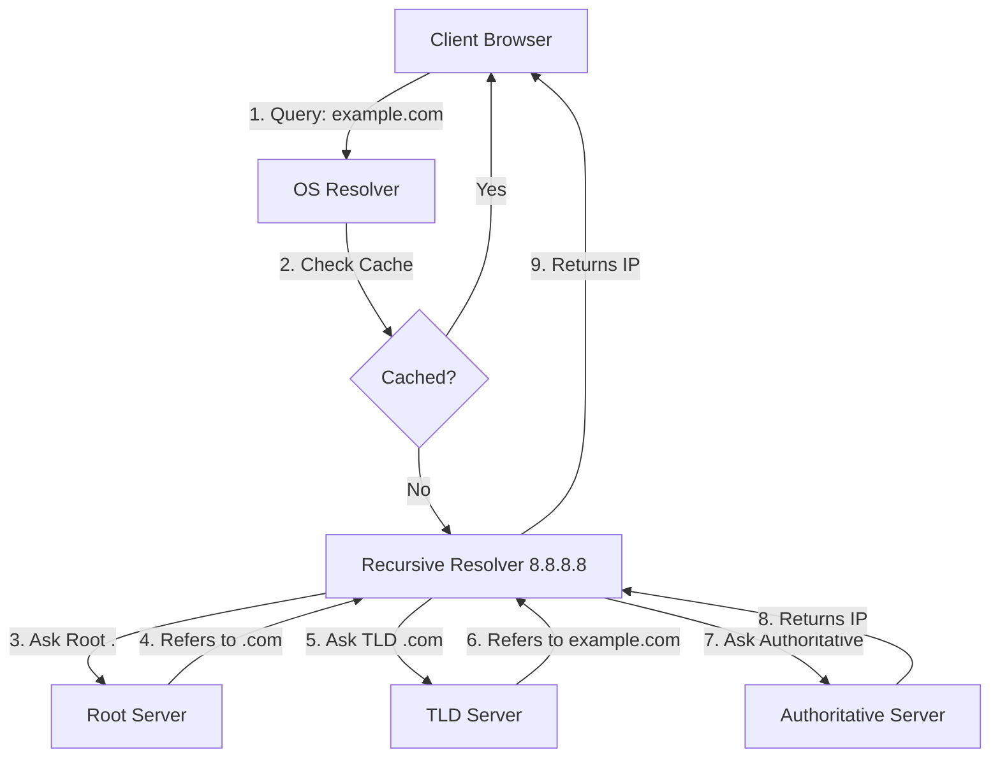

import Quiz from '@site/src/components/Quiz';

<Quiz 
  questions={[
    {
      questionText: 'Which DNS record maps a specific Hostname to an IPv4 address?',
      options: ['AAAA Record', 'MX Record', 'A Record', 'CNAME Record'],
      answer: 'A Record',
    },
    {
      questionText: 'What port does DNS primarily use?',
      options: ['TCP 80', 'UDP 53', 'TCP 443', 'UDP 67'],
      answer: 'UDP 53',
    },
    {
      questionText: 'Which server holds the actual DNS records for a domain (the source of truth)?',
      options: ['Recursive Resolver', 'Root Server', 'Authoritative Name Server', 'ISP Resolver'],
      answer: 'Authoritative Name Server',
    }
  ]}
/>

 

## Basic Level

### What is DNS and why is it important in networking?

- **DNS (Domain Name System)** translates human-readable domain names (like `www.google.com`) into IP addresses (like `142.250.64.78`).
- It’s essential because users access websites using domain names, but computers communicate using IPs.
- Without DNS, we would have to memorize IP addresses for every website we visit.

### Components of DNS

- **Domain Name Space:** A tree-like structure where each node represents a domain.
    - **Root:** The top of the tree (e.g., `.`).
    - **Top Level Domain (TLD):** `.com`, `.org`, `.edu`, `.gov`, `.mil`, `.net`, `.int`.
    - **Second Level Domain:** `google` in `google.com`.
    - **Subdomain:** `maps` in `maps.google.com`.

### What are the different types of DNS records?

There are many types of DNS records. Here are the most common ones:

| Type | Full Form | Purpose |
| --- | --- | --- |
| **A** | Address Record | Maps a **domain name to an IPv4 address**. |
| **AAAA** | IPv6 Address Record | Maps a **domain name to an IPv6 address**. |
| **CNAME** | Canonical Name | **Alias** of one domain to another (e.g., `www` → `example.com`). |
| **MX** | Mail Exchange | Specifies **mail servers** for a domain and their priority. |
| **NS** | Name Server | Indicates the **authoritative DNS servers** for the domain. |
| **PTR** | Pointer Record | Used for **reverse DNS** lookups: maps IP address → hostname. |
| **SOA** | Start of Authority | Holds admin info about the domain (serial number, refresh rate). |
| **TXT** | Text Record | Holds arbitrary text (SPF, DKIM, verification). |
| **SRV** | Service Locator | Specifies **services** (like SIP/LDAP), ports, and priorities. |
| **CAA** | Certification Authority Authorization | Specifies which CAs can issue certs for the domain. |

### What happens when you type a URL into the browser? (DNS Part)

This process is called **DNS Resolution**.

1.  **Browser Cache Check:** Browser checks if it already knows the IP. If yes, done.
2.  **OS/Stub Resolver Cache Check:** OS checks its own cache (e.g., `ipconfig /displaydns`).
3.  **Recursive Resolver Query:** Validates against ISP's DNS (e.g., `8.8.8.8`).
4.  **Root Server Query:** Recursive resolver asks Root (`.`) "Who handles `.com`?".
5.  **TLD Server Query:** Recursive resolver asks TLD (`.com`) "Who handles `example.com`?".
6.  **Authoritative Server Query:** Recursive resolver asks Authoritative Server "What is the IP for `www.example.com`?".
7.  **Response:** Authoritative server returns the **A Record** (IP).
8.  **Caching:** Recursive resolver caches the IP and sends it to the OS/Browser.
9.  **Connection:** Browser initiates TCP connection to the IP.

:::tip ELI5 Analogy: Ordering Pizza
- **You (Client):** "I want pizza from Domino's."
- **Phone Contact List (OS Cache):** "Do I have their number?" No.
- **Receptionist (Recursive Resolver):** "I'll find it for you."
- **Directory Assistance (Root):** "I don't know Domino's, but I know who handles all 'Pizza' listings." (Points to TLD)
- **Pizza Listings (TLD):** "I know where Domino's Head Office is." (Points to Authoritative)
- **Domino's HQ (Authoritative):** "Here is the number for your local store." (Returns IP)
:::

### What is TTL in DNS? Why is it important?

**TTL (Time to Live)** is a value (in seconds) that tells DNS resolvers how long to **cache a DNS record** before checking with the authoritative server again.

- **High TTL (e.g., 24 hours):** Good for static sites. Reduces traffic, faster lookups, but updates take longer to propagate.
- **Low TTL (e.g., 60 seconds):** Good for critical services or during migrations. Updates propagate quickly, but increases load on servers.

### What is a reverse DNS lookup?

**Reverse DNS (rDNS)** resolves an **IP address back to a domain name**.
- **Query:** `104.18.12.123` → `openai.com`.
- **Uses:** Email filtering (SPAM checks), logging, network troubleshooting (`traceroute`).
- **Record Type:** Uses **PTR** records stored in `in-addr.arpa` (IPv4) or `ip6.arpa` (IPv6).

## Intermediate Level

### Difference between CNAME and A record?

| Feature | A Record | CNAME Record |
| --- | --- | --- |
| **Maps to** | An **IP Address** | Another **Domain Name** |
| **Performance** | Faster (1 lookup) | Slower (2 lookups: CNAME → A Record) |
| **Root Domain** | Can be used at root (`example.com`) | **Cannot** be used at root (only subdomains) |
| **Coexistence** | Can coexist with other records | **Cannot** coexist with other records for the same name |

### What are Root, TLD, and Authoritative Servers?

1.  **Root Servers:** The starting point. Maintain locations of TLD servers. only 13 logical root servers exist (A-M).
2.  **TLD Servers:** Manage top-level domains (`.com`, `.net`). They know who the authoritative servers are for subdomains.
3.  **Authoritative Servers:** The final source of truth. They hold the actual records (A, MX, etc.) for a specific domain.

### Iterative vs. Recursive DNS Queries

| Inquiry Type | Who does the work? | Description | Analogy |
| --- | --- | --- | --- |
| **Recursive** | **Server** | Client asks server: "Get me the IP." Server does all the hunting and returns the final answer. | "Go find me the answer." |
| **Iterative** | **Client** | Client asks server: "Do you know?" Server says: "No, but ask this guy." Client asks the next guy. | "Point me in the right direction." |

> **Note:** PC → Resolver is usually **Recursive**. Resolver → Internet is usually **Iterative**.

### When does DNS use TCP instead of UDP?

DNS primarily uses **UDP Port 53** for speed and low overhead. It switches to **TCP Port 53** when:
1.  **Response size > 512 bytes:** If the response is too large (e.g., DNSSEC signatures, many records), the server sets the **TC (Truncation)** bit, telling the client to retry via TCP.
2.  **Zone Transfers:** Syncing data between Primary and Secondary DNS servers always uses TCP for reliability.

### How does DNS Load Balancing work?

**Round-Robin DNS:**
- You create multiple **A Records** for the same domain pointing to different IPs.
- `www.example.com` → `192.168.1.1`
- `www.example.com` → `192.168.1.2`
- The DNS server cycles through the IPs in responses.
- **Pros:** Simple, cheap.
- **Cons:** No health checks (will serve dead IPs), clients may cache one IP for a long time.

## Advanced Level

### How would you troubleshoot DNS issues?

**Troubleshooting Flow:** `Client Cache → OS Cache → Resolver → Authoritative Server`

1.  **Check Connectivity:** `ping 8.8.8.8` (Is internet works?)
2.  **Check Resolution:** `nslookup google.com` or `dig google.com` (Do I get an IP?)
3.  **Trace Path:** `dig +trace google.com` (Where does it fail? Root? TLD?)
4.  **Check Specific Records:** `dig mx google.com` (Checking mail records)
5.  **Clear Cache:** `ipconfig /flushdns` (Is my local data stale?)
6.  **Check DNSSEC:** `dig +dnssec google.com` (Is validation failing?)

### What causes a DNS response to exceed 512 bytes?

- **DNSSEC:** Adding cryptographic signatures (`RRSIG`) adds significant size.
- **IPv6:** `AAAA` records are larger than `A` records.
- **Many Records:** Returning 20 IP addresses for load balancing.
- **EDNS0:** Extension mechanisms allow larger UDP packets (up to 4096 bytes) to avoid falling back to TCP too early.

### What is DNS Poisoning/Spoofing?

- **Attack:** An attacker injects fake DNS records into a recursive resolver's cache.
- **Result:** Users typing `bank.com` are transparently redirected to `attacker-site.com`.
- **Prevention:**
    - **DNSSEC:** Cryptographically signs records so resolvers can verify authenticity.
    - **Randomize Source Ports:** Makes it harder for attackers to guess the correct port to inject a fake response.
    - **DoH/DoT:** Encrypts DNS traffic to prevent Man-in-the-Middle tampering.

### Introduction to DNSSEC (Security Extensions)

DNS was designed without security. DNSSEC adds a layer of trust.
- **Signing:** Owners sign their zones with a Private Key.
- **Verification:** Resolvers verify records using the Public Key.
- **Chain of Trust:** Root signs `.com`, `.com` signs `google.com`.
- **Records:**
    - `RRSIG`: The signature.
    - `DNSKEY`: The public key.
    - `DS`: Delegation Signer (fingerprint of the key).

### What are SRV Records?

SRV records define the **location (host + port)** of servers for specific services.
- **Format:** `_service._proto.name TTL IN SRV priority weight port target`
- **Example:** `_sip._tcp.example.com` points to `sipserver.example.com` on port `5060`.
- **Used by:** VoIP (SIP), Active Directory (LDAP/Kerberos), Minecraft, XMPP.

### Can a CNAME coexist with other records?

**No.**
- If `www.example.com` is a CNAME to `other.com`, it **cannot** have an A record, MX record, or any other record.
- **Exception:** DNSSEC records (`RRSIG`, `NSEC`) can exist to prove the CNAME exists.
- This is why you usually **cannot use CNAME at the root** domain (`example.com`), because root needs `SOA` and `NS` records. (Use `ALIAS` or `ANAME` records if your provider supports them).