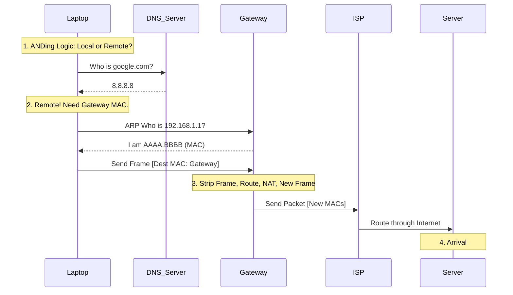

import Quiz from '@site/src/components/Quiz';

# 📦 Life of a Packet: A Step-by-Step Journey

Ever wondered what happens when you type `google.com` and hit Enter? This guide breaks down the milliseconds-long journey of a data packet from your laptop to a server across the world, including the hidden math of Subnetting and ARP.

---

## 🎬 Phase 1: The Setup (The Application Layer)

**Scenario**: You are on your laptop (IP: `192.168.1.5` / `255.255.255.0`) and you want to visit a web server (IP: `8.8.8.8`).

### Step 1: DNS Resolution (The Address Book)
Computers don't speak "English," they speak numbers. Your browser cannot send data to "google.com".
1.  **Browser checks cache**: "Do I know this IP?"
2.  **OS checks cache**: "Do I know this IP?"
3.  **query sent to DNS Server**: "Who is google.com?"
4.  **DNS Server replies**: "Google is `8.8.8.8`."

*Now we have the Destination IP.*

---

## 📦 Phase 2: Encapsulation (Packing the Box)

Your data needs to be wrapped in layers (like an envelope inside a box inside a truck).

### Step 2: Transport Layer (L4) - The Segment
*   **Protocol**: TCP (Reliable) or UDP (Fast). Let's assume TCP.
*   **Action**: Data is chopped into chunks.
*   **Headers Added**: Source Port (Random: `50123`), Destination Port (Web: `443`).

### Step 3: Network Layer (L3) - The Packet
*   **Action**: The Segment is put inside a Packet.
*   **Headers Added**: Source IP (`192.168.1.5`), Destination IP (`8.8.8.8`).

---

## 🧠 Phase 2.5: The Routing Decision (Subnet Math)

Before sending anything, your computer must decide: **Is this destination LOCAL (on my wifi) or REMOTE (internet)?**

It uses **Boolean AND** logic with your Subnet Mask.

1.  **My Network**: `192.168.1.5` AND `255.255.255.0` = **192.168.1.0**
2.  **Destination Network**: `8.8.8.8` AND `255.255.255.0` = **8.8.8.0**

**Result**: `192.168.1.0` != `8.8.8.0`. They are different.
**Conclusion**: "I cannot deliver this directly. I must send it to my **Default Gateway**."

> **Note**: If the result matched (e.g., sending to 192.168.1.9), computer would skip the router and go straight to the neighbor.

---

## 📨 Phase 3: Data Link Layer (L2) & ARP

### Step 4: The Frame & The MAC Address
*   **Action**: The Packet is put inside an Ethernet Frame.
*   **Source MAC**: `Laptop_MAC`
*   **Destination MAC**: **??** (It CANNOT be the Server's MAC. It must be the Next Hop's MAC).

### Step 5: ARP (Address Resolution Protocol)
"I know the Gateway IP (`192.168.1.1`), but I need its MAC address to build the frame."
1.  **Request**: "Who has `192.168.1.1`? Tell `192.168.1.5`!" (Broadcast `FF:FF:FF:FF:FF:FF`).
2.  **Reply**: Router says "I have `192.168.1.1`. My MAC is `AAAA.BBBB.CCCC`."
3.  **Encapsulation Complete**: Frame is sealed with Dest MAC `AAAA.BBBB.CCCC`.

---

## 🌍 Phase 4: The Gateway & The Internet (The Copy-Paste)

### Step 6: The Router (Default Gateway)
The Router receives the frame.
1.  **Strip Frame**: Removes the Ethernet header. (Goodbye `Laptop_MAC` and `Router_MAC`).
2.  **Inspect Packet**: "Dest IP is `8.8.8.8`. Route table says go out WAN interface."
3.  **NAT**: Swaps `192.168.1.5` -> `203.0.113.5` (Public IP).
4.  **New Frame**: The router builds a **NEW** frame.
    *   **New Source MAC**: `Router_WAN_MAC`
    *   **New Dest MAC**: `ISP_Router_MAC`

> **Critical Concept**: **IP Addresses stay the same** (mostly) from start to finish. **MAC Addresses change** at every single hop (Router).

### Step 7: The Internet (Hops)
The packet travels through 10-20 routers. At EVERY router:
1.  Old Frame is discarded.
2.  IP is inspected.
3.  New Frame is created for the next neighbor.

---

## 🏁 Phase 5: The Destination

### Step 8: The Server
The packet arrives at Google (`8.8.8.8`).
1.  **Decapsulate**: Frame is gone. packet is gone. Segment is gone.
2.  **Process**: Web server reads "GET /" request.

### Step 9: The Return Trip
The server replies.
*   Src IP: `8.8.8.8`, Dest IP: `203.0.113.5`.
*   NAT on your router remembers the session and forwards it back to `192.168.1.5`.

---

## 🎓 Packet Flow Quiz

<Quiz 
  questions={[
    {
      questionText: 'Which address changes at every router hop?',
      options: ['IP Address', 'MAC Address', 'Port Number', 'DNS Name'],
      answer: 'MAC Address',
    },
    {
      questionText: 'What logic does a host use to know if a destination is Local or Remote?',
      options: ['DNS Lookup', 'ARP Request', 'ANDing IP with Subnet Mask', 'Ping'],
      answer: 'ANDing IP with Subnet Mask',
    },
    {
      questionText: 'If the destination is Remote, whose MAC address is used in the frame?',
      options: ['The Destination Server', 'The Default Gateway', 'The Switch', 'The DNS Server'],
      answer: 'The Default Gateway',
    },
    {
      questionText: 'Which protocol maps an IP address to a MAC address?',
      options: ['DNS', 'DHCP', 'ARP', 'ICMP'],
      answer: 'ARP',
    },
    {
      questionText: 'What is the "Broadcast MAC Address" used for ARP requests?',
      options: ['00:00:00:00:00:00', 'FF:FF:FF:FF:FF:FF', '192.168.1.255', '255.255.255.255'],
      answer: 'FF:FF:FF:FF:FF:FF',
    },
    {
      questionText: 'Does the Destination IP address change as the packet travels through the internet (ignoring NAT)?',
      options: ['Yes, at every hop', 'No, it stays constant', 'Only at Autonomous System boundaries', 'Only when using IPv6'],
      answer: 'No, it stays constant',
    },
    {
      questionText: 'At which OSI layer does the "Routing Decision" happen?',
      options: ['Layer 2 (Data Link)', 'Layer 3 (Network)', 'Layer 4 (Transport)', 'Layer 7 (Application)'],
      answer: 'Layer 3 (Network)',
    },
    {
      questionText: 'What does a router do with the Layer 2 Frame when it receives a packet?',
      options: ['Forwards it unchanged', 'Modifies the Source MAC only', 'Strips/Discards it completely', 'Modifies the CRC'],
      answer: 'Strips/Discards it completely',
    },
    {
      questionText: 'If your computer wants to send data to 192.168.1.50 (same subnet), does it go to the Gateway?',
      options: ['Yes, always', 'No, it goes directly to the device', 'Only if DNS fails', 'Only if using TCP'],
      answer: 'No, it goes directly to the device',
    },
    {
      questionText: 'Which process changes the Private IP to a Public IP?',
      options: ['Routing', 'Switching', 'NAT', 'DHCP'],
      answer: 'NAT',
    }
  ]}
/>

---

## visual Summary

