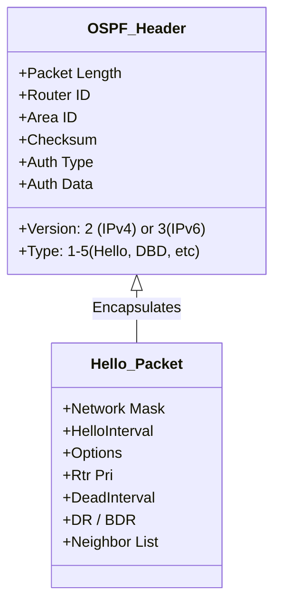

import Quiz from '@site/src/components/Quiz';

# 🎓 OSPF Master Class: The Deep Dive

Welcome to the advanced section. Here we visualize the invisible—how OSPF actually forms relationships and makes decisions.

## 🔄 Visualizing OSPF Neighbor States

This animated diagram shows the journey of two routers becoming neighbors.

```mermaid
stateDiagram-v2
    direction LR
    [*] --> Down: Start
    Down --> Init: Hello Received
    Init --> TwoWay: Router ID Seen in Hello
    TwoWay --> ExStart: Elect Master/Slave
    ExStart --> Exchange: DBD Packets Exchanged
    Exchange --> Loading: LSRs and LSUs
    Loading --> Full: Databases Synchronized
    Full --> [*]: Adjacency Complete
```

### 🧠 Understanding the States
1.  **Down**: No Hello packets received.
2.  **Init**: Hello received, but my Router ID is *not* in it yet.
3.  **2-Way**: I see my own Router ID in your Hello. (DR/BDR elected here).
4.  **ExStart**: Discussing "Who goes first?". Comparison of Router IDs to elect Master/Slave.
5.  **Exchange**: Swapping summaries (DBD headers). "I have LSAs A, B, C."
6.  **Loading**: Asking for details. "Give me the full body of LSA B." (LSR/LSU).
7.  **Full**: We have identical databases.

---

## 📦 OSPF Packet Anatomy

OSPF runs directly on top of IP (Protocol 89). It does not use TCP or UDP.

### The 5 OSPF Packet Types
1.  **Hello (Type 1)**: Discovers neighbors and acts as a heartbeat.
2.  **DBD (Database Description - Type 2)**: Summary of the LSDB (headers only). Used in *Exchange* state.
3.  **LSR (Link State Request - Type 3)**: "I need more info on this specific LSA." Used in *Loading* state.
4.  **LSU (Link State Update - Type 4)**: The actual data. Carries the LSAs. Sent in response to LSRs or changes.
5.  **LSAck (Link State Acknowledgment - Type 5)**: "Got it." Ensures reliability (since OSPF doesn't use TCP).

---

## 🌐 OSPF Network Types

The type of network determines how OSPF behaves (Hello timers, DR/BDR election).

| Network Type | DR/BDR? | Hello Timer | Topology Example |
| :--- | :--- | :--- | :--- |
| **Broadcast** | **Yes** | 10s | Ethernet (LAN) |
| **Point-to-Point** | **No** | 10s | Serial link (HDLC/PPP) |
| **Non-Broadcast (NBMA)** | **Yes** | 30s | Frame Relay / ATM (Legacy) |
| **Point-to-Multipoint** | **No** | 30s | DMVPN (Hub & Spoke) |

> **Critical Note**: A "Hellos Mismatch" (e.g., 10s vs 30s) prevents adjacency. You must match network types on both ends!

---

## 🧮 Metric Calculation (Cost)

OSPF uses **Cost** as its metric. Lower is better.

**Formula**:
`Cost = Reference Bandwidth / Interface Bandwidth`

*   **Default Ref BW**: 100 Mbps ($10^8$).
*   **FastEthernet (100M)**: Cost = 1.
*   **GigabitEthernet (1000M)**: Cost = 1 (OSPF treats 1G same as 100M by default!).

> **Fix for Modern Networks**: Change reference bandwidth to account for Gigabit/10G links.
> `auto-cost reference-bandwidth 10000` (Make 10G = 1).

---

## 🧩 Decoding LSAs (Link State Advertisements)

| LSA Type | Name | Who Generates It? | Scope | What it tells us |
| :--- | :--- | :--- | :--- | :--- |
| **Type 1** | **Router LSA** | **Every Router** | Area Local | "I am Router X, and I am connected to these links." |
| **Type 2** | **Network LSA** | **DR (Designated Router)** | Area Local | "I am the DR for this segment, and these routers are attached here." |
| **Type 3** | **Summary LSA** | **ABR (Area Border Router)** | Inter-Area | "Here are the networks I know from other areas." |
| **Type 4** | **ASBR Summary** | **ABR** | Inter-Area | "Here is how you reach the ASBR router." |
| **Type 5** | **External LSA** | **ASBR** | AS Wide (Domain) | "Here is a route from outside OSPF (e.g., EIGRP/BGP)." |
| **Type 7** | **NSSA External**| **ASBR (in NSSA)** | NSSA Local | "External route (like Type 5) but allowed in NSSA." |

---

## 📉 Summarization & Filtering

Reduces table size and limits LSA flooding.

1.  **Inter-Area (Type 3) Summarization**:
    *   Configured on **ABR**.
    *   Command: `area 1 range 192.168.0.0 255.255.0.0`
    *   Effect: Replaces specific network Type 3 LSAs with one summary LSA.

2.  **External (Type 5) Summarization**:
    *   Configured on **ASBR**.
    *   Command: `summary-address 10.0.0.0 255.0.0.0`

---

## 🔗 Virtual Links

Used to repair a broken hierarchy (when an area cannot physically connect to Area 0).

*   **Requirement**: Transit area must not be a Stub area.
*   **Command**: `area 1 virtual-link <Router-ID-of-Other-End>`
*   **Use Case**: Merging two companies, or temporary fiber cut.

---

## 🛠️ Troubleshooting Scenario: "Stuck in EXSTART"

**The Problem**: Two routers find each other, go through `Init` and `2-Way`, but hang indefinitely in `EXSTART` or `EXCHANGE` state.

**The Diagnosis**:
This is almost always an **MTU (Maximum Transmission Unit)** mismatch.

**The Fix**:
1. Check MTU: `show ip interface serial0/0`
2. Match them on both sides.

---

## 🚀 Ultimate OSPF Challenge (20 Questions)

<Quiz 
  questions={[
    {
      questionText: 'Scenario: Two routers stuck in "EXSTART". Check MTU.',
      options: ['Hello Timer Mismatch', 'Authentication Failure', 'MTU Mismatch', 'Area ID Mismatch'],
      answer: 'MTU Mismatch',
    },
    {
      questionText: 'Which LSA allows traffic to leave a Stub area?',
      options: ['Type 5 LSA', 'Type 3 Default Route', 'Type 7 LSA', 'Type 1 LSA'],
      answer: 'Type 3 Default Route',
    },
    {
      questionText: 'Protocol Number for OSPF?',
      options: ['88', '89', '6', '17'],
      answer: '89',
    },
    {
      questionText: 'Which state are DR/BDR elected in?',
      options: ['Init', '2-Way', 'ExStart', 'Full'],
      answer: '2-Way',
    },
    {
      questionText: 'Which LSA never leaves its area?',
      options: ['Type 1 & 2', 'Type 3', 'Type 5', 'Type 4'],
      answer: 'Type 1 & 2',
    },
    {
      questionText: 'What is the default Hello Timer on a Broadcast network?',
      options: ['5s', '10s', '30s', '60s'],
      answer: '10s',
    },
    {
      questionText: 'Which router generates a Type 2 Network LSA?',
      options: ['ABR', 'ASBR', 'DR', 'Dropped Router'],
      answer: 'DR',
    },
    {
      questionText: 'What happens if Router IDs are identical?',
      options: ['Adjacency forms', 'Load balancing', 'Adjacency fails/flaps', 'One router shuts down'],
      answer: 'Adjacency fails/flaps',
    },
    {
      questionText: 'How do you calculate Cost for a 100Mbps link with default reference bandwidth?',
      options: ['1', '10', '100', '1000'],
      answer: '1',
    },
    {
      questionText: 'Which area type blocks Type 4 and 5 LSAs but allows Type 3?',
      options: ['Standard', 'Stub', 'Totally Stub', 'NSSA'],
      answer: 'Stub',
    },
    {
      questionText: 'Which command creates a summary route on an ABR?',
      options: ['summary-address', 'area range', 'ip route summary', 'aggregate-address'],
      answer: 'area range',
    },
    {
      questionText: 'A Virtual Link is needed when...',
      options: ['An area has no physical connection to Area 0', 'An area is too large', 'Backbone is down', 'Stub area needs external routes'],
      answer: 'An area has no physical connection to Area 0',
    },
    {
      questionText: 'Can a Virtual Link transit through a Stub Area?',
      options: ['Yes', 'No', 'Only if Totally Stub', 'Only if NSSA'],
      answer: 'No',
    },
    {
      questionText: 'What is the multicast address for All OSPF Routers?',
      options: ['224.0.0.5', '224.0.0.6', '224.0.0.9', '224.0.0.10'],
      answer: '224.0.0.5',
    },
    {
      questionText: 'What is the multicast address for DR/BDR only?',
      options: ['224.0.0.5', '224.0.0.6', '224.0.0.9', '224.0.0.10'],
      answer: '224.0.0.6',
    },
    {
      questionText: 'Which packet type contains the LSA headers (summary of database)?',
      options: ['Hello', 'DBD', 'LSR', 'LSU'],
      answer: 'DBD',
    },
    {
      questionText: 'If Reference Bandwidth is 100Mbps, what is the cost of a 10Mbps Ethernet link?',
      options: ['1', '10', '100', '1000'],
      answer: '10',
    },
    {
      questionText: 'Which command injects a default route into OSPF?',
      options: ['ip route 0.0.0.0', 'default-information originate', 'redistribute static', 'network 0.0.0.0'],
      answer: 'default-information originate',
    },
    {
      questionText: 'What does a Type 4 LSA advertise?',
      options: ['Reachability to a network', 'Reachability to an ASBR', 'External route', 'Summary route'],
      answer: 'Reachability to an ASBR',
    },
    {
      questionText: 'In a Point-to-Point network, is a DR elected?',
      options: ['Yes', 'No', 'Only if configured', 'Depends on priority'],
      answer: 'No',
    }
  ]}
/>
