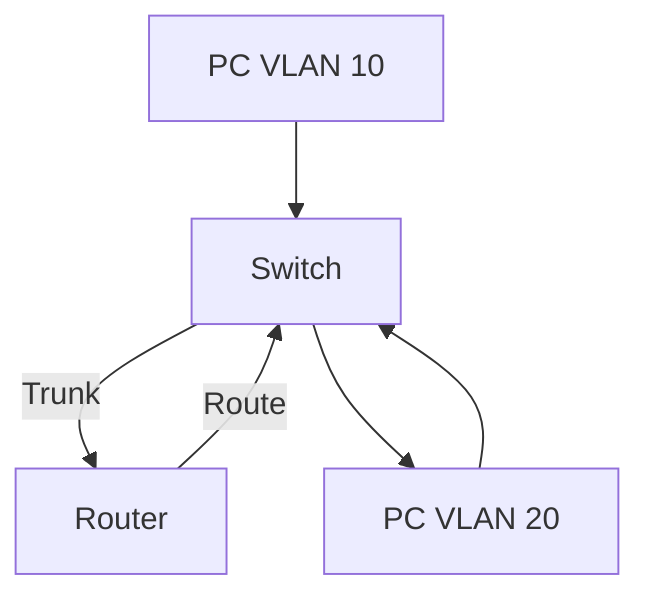

import Quiz from '@site/src/components/Quiz';

# 🔌 VLAN Master Class: Segmenting the Network

Welcome to the Layer 2 Deep Dive. Here we break down how switches use VLANs to create virtual boundaries and how Trunks carry that traffic.

---

## 🏗️ The Problem: Broadcast Domains

By default, a Switch is one giant **Broadcast Domain**.
*   If Computer A sends a Broadcast (ARP), **EVERY** device on the switch receives it.
*   **Security Risk**: HR can see Engineering traffic.
*   **Performance Risk**: One noisy NIC slows down the whole company.

**Solution**: **VLANs (Virtual Local Area Networks)**.
*   Logically slicing one physical switch into multiple virtual switches.
*   Traffic cannot cross from VLAN 10 to VLAN 20 without a Router (Layer 3).

---

## 🏷️ 802.1Q Tagging (The "Sticker")

When traffic stays *inside* a switch, the switch knows which port belongs to which VLAN. But when traffic crosses a wire between switches (a **Trunk**), the receiving switch needs to know: "Which VLAN does this belong to?"

**The 802.1Q Tag**:
*   Inserted into the Ethernet Frame.
*   **Size**: 4 Bytes.
*   **TPID**: Tag Protocol ID (0x8100) - "Hey, I'm a tagged frame!"
*   **TCI**: Priority (CoS) and **VLAN ID (12 bits)**.

> **Native VLAN**: The ONE VLAN on a trunk that is **Untagged**. (Default: VLAN 1).
> *   If a switch receives an untagged frame on a Trunk, it puts it in the Native VLAN.
> *   **Security Risk**: VLAN Hopping if Native VLANs don't match.

---

## 🌉 Trunking & DTP (Dynamic Trunking Protocol)

How do ports decide to become Trunks? Cisco uses DTP.

| Mode | Behavior |
| :--- | :--- |
| **Switchport Mode Access** | I am a host port. No trunking allowed. |
| **Switchport Mode Trunk** | I am a trunk. I will tag frames. |
| **Dynamic Auto** | I am willing to trunk, but I wait for you to ask (Default on old switches). |
| **Dynamic Desirable** | I actively ask to become a trunk. |

**Negotiation Table**:
*   Auto + Auto = **Access** (No Trunk)
*   Auto + Desirable = **Trunk**
*   Desirable + Desirable = **Trunk**
*   Trunk + (Auto/Desirable/Trunk) = **Trunk**

---

## 💣 VTP (VLAN Trunking Protocol)

VTP is designed to sync VLANs (Create VLAN 10 on Server -> Replicates to all Clients).

**Modes**:
1.  **Server** (Default): Creates/Deletes VLANs. Syncs to others.
2.  **Client**: Cannot create VLANs. Syncs from Server.
3.  **Transparent**: Creates local VLANs. Does **NOT** sync, but forwards VTP advertisements.

**The "VTP Bomb"**:
*   If you plug in an old switch (Client mode) with a **Higher Revision Number**, it will overwrite the VLAN database of the *entire network*.
*   **Prevention**: Always reset Revision Number (Change Domain name or mode to Transparent) before adding a new switch.

---

## 🚧 Inter-VLAN Routing

How do VLAN 10 and VLAN 20 talk? They need a Default Gateway.

### Method 1: Router-on-a-Stick (ROAS)
*   One physical cable from Switch to Router.
*   Router creates "Sub-interfaces" (e.g., `Gi0/0.10`).
*   Config: `encapsulation dot1q 10`.

### Method 2: SVI (Switch Virtual Interface) - Layer 3 Switch
*   The Switch *is* the Router.
*   Config: `interface vlan 10`, `ip address 192.168.10.1`.
*   Faster (Hardware routing) than ROAS.

---

## 🎓 Ultimate Switching Quiz (20 Questions)

<Quiz 
  questions={[
    {
      questionText: 'Which protocol is the industry standard for Trunking?',
      options: ['ISL', '802.1Q', 'DTP', 'VTP'],
      answer: '802.1Q',
    },
    {
      questionText: 'What constitutes the "Native VLAN"?',
      options: ['It is always VLAN 1', 'Traffic is untagged', 'It has higher priority', 'It is for management only'],
      answer: 'Traffic is untagged',
    },
    {
      questionText: 'If DTP mode is "Auto" on both ends, what is the link state?',
      options: ['Trunk', 'Access', 'Error-Disabled', 'Half-Duplex'],
      answer: 'Access',
    },
    {
      questionText: 'Which VTP mode forwards advertisements but does not sync its own database?',
      options: ['Server', 'Client', 'Transparent', 'Off'],
      answer: 'Transparent',
    },
    {
      questionText: 'What is the danger of a higher VTP Revision Number?',
      options: ['It causes a loop', 'It overwrites the domain VLANs', 'It disables all ports', 'It creates a broadcast storm'],
      answer: 'It overwrites the domain VLANs',
    },
    {
      questionText: 'How many bytes does the 802.1Q tag add to a frame?',
      options: ['2 Bytes', '4 Bytes', '16 Bytes', '32 Bytes'],
      answer: '4 Bytes',
    },
    {
      questionText: 'Which command creates a sub-interface for VLAN 10?',
      options: ['interface vlan 10', 'interface gi0/0.10', 'switchport access vlan 10', 'encapsulation vlan 10'],
      answer: 'interface gi0/0.10',
    },
    {
      questionText: 'Traffic between two different VLANs requires...',
      options: ['A Trunk', 'A Router (Layer 3)', 'VTP', 'STP'],
      answer: 'A Router (Layer 3)',
    },
    {
      questionText: 'In 802.1Q, what is the maximum VLAN ID?',
      options: ['1005', '4094', '4096', '65535'],
      answer: '4094',
    },
    {
      questionText: 'Which DTP mode ACTIVELY asks to become a trunk?',
      options: ['Auto', 'Desirable', 'Negotiate', 'Passive'],
      answer: 'Desirable',
    },
    {
      questionText: 'What happens if Native VLANs mismatch on a trunk?',
      options: ['Trunk fails', 'VLAN Leaking / Traffic loss', 'VTP Bomb', 'STP Loop'],
      answer: 'VLAN Leaking / Traffic loss',
    },
    {
      questionText: 'Which command assigns a port to VLAN 10?',
      options: ['switchport trunk vlan 10', 'switchport access vlan 10', 'vlan 10 enable', 'encapsulation dot1q 10'],
      answer: 'switchport access vlan 10',
    },
    {
      questionText: 'Can a VTP Client create a VLAN?',
      options: ['Yes', 'No', 'Only if the Server is down', 'Yes, if in same domain'],
      answer: 'No',
    },
    {
      questionText: 'Which SVI command enables routing on a Layer 3 Switch?',
      options: ['ip routing', 'router ospf 1', 'vlan routing', 'no switchport'],
      answer: 'ip routing',
    },
    {
      questionText: 'What is the default VTP mode on a Cisco switch?',
      options: ['Server', 'Client', 'Transparent', 'Off'],
      answer: 'Server',
    },
    {
      questionText: 'What is the purpose of VTP Pruning?',
      options: ['Delete unused VLANs', 'Stop flooding traffic to switches that dont have that VLAN', 'Reset revision number', 'Secure trunk links'],
      answer: 'Stop flooding traffic to switches that dont have that VLAN',
    },
    {
      questionText: 'Which command confirms trunk status?',
      options: ['show ip interface brief', 'show interfaces trunk', 'show vlan brief', 'show dtp'],
      answer: 'show interfaces trunk',
    },
    {
      questionText: 'Switchport "Nonegotiate" does what?',
      options: ['Disables STP', 'Disables VTP', 'Disables DTP', 'Forces Access Mode'],
      answer: 'Disables DTP',
    },
    {
      questionText: 'What type of interface is used for Router-on-a-Stick?',
      options: ['Physical Interface', 'SVI', 'Sub-interface', 'Loopback'],
      answer: 'Sub-interface',
    },
    {
      questionText: 'If a frame is larger than 1522 bytes, it is called a...',
      options: ['Jumbo Frame', 'Baby Giant', 'Runt', 'Giant'],
      answer: 'Baby Giant',
    }
  ]}
/>
